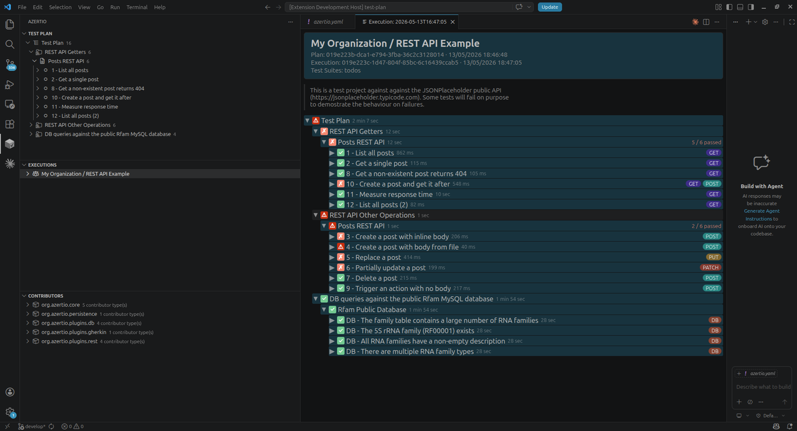

# Azertio — Open Black-Box Testing

Azertio is an extensible, plugin-based black-box testing platform for Java. Write expressive tests in plain DSL, run them against REST APIs, databases, or any custom system — with zero boilerplate and zero glue code.

[](LICENSE)
[](https://openjdk.org/projects/jdk/21/)

---

## Features

- **Plugin architecture** — every capability (test format, steps, reports) is a Maven artifact loaded at runtime via the Java Platform Module System (JPMS). No classpath conflicts, no rebuilds.
- **Human-readable DSL** — tests are plain Gherkin `.feature` files in English, Spanish, or a compact DSL shorthand. Non-developers can read and validate them.
- **Two-level scenarios** — separate the *what* (business-readable definition) from the *how* (concrete technical implementation), optionally in different natural languages.
- **REST API testing** — full HTTP step vocabulary: GET/POST/PUT/PATCH/DELETE, body assertions (JSON, XML, text), variable extraction and interpolation.
- **Database testing** — any JDBC database, declared as a runtime dependency. Steps for SQL execution, row count assertions, table content comparison, and CSV/Excel fixture loading.
- **Benchmark mode** — run any step N times across T virtual threads and assert on min/max/mean/P50/P95/P99/throughput/errorRate — in the same `.feature` file as functional tests.
- **Configurable persistence** — three modes: transient (CI), local file (developer workstation), or remote PostgreSQL + MinIO (team-shared execution history).
- **VS Code extension** — browse executions, inspect result trees, view attachments, and re-run past executions directly from the editor.
- **Profiles** — named environment configurations in `azertio.yaml`, switched with a single CLI flag.
- **Tag-based suite filtering** — boolean tag expressions (`GET and not slow`) define named test suites in configuration.

---

## Getting Started

See the **[Getting Started guide](docs/getting-started.md)** for installation, PATH setup, plugin configuration, and running your first test plan.

### Requirements

- Java 21 or higher
- Internet access for plugin downloads (or a configured Maven repository)

### Quick example

```yaml
# azertio.yaml
project:
  name: My API Tests
  test-suites:
    - name: smoke
      tag-expression: "smoke"
    - name: regression
      tag-expression: "regression"

plugins:
  - gherkin
  - rest

configuration:
  rest:
    baseURL: https://api.example.com
    timeout: 10000
```

```gherkin
# tests/smoke.feature
@smoke @GET
Scenario: Health check returns 200
  When I make a GET request to "health"
  Then the HTTP status code is equal to 200
```

```bash
azertio install
azertio run -s smoke -p staging
```

---

## Project Structure

```
azertio/
├── azertio-core/                       # Core interfaces, execution engine, persistence contracts
├── azertio-cli/                        # CLI entry point (picocli)
├── azertio-persistence/                # Persistence layer (HSQLDB / PostgreSQL via jOOQ, MinIO)
├── azertio-jsonrpc/                    # JSON-RPC 2.0 server over stdio (VS Code ↔ CLI bridge)
├── azertio-lsp/                        # Language Server Protocol support
├── azertio-docgen-maven-plugin/        # Maven plugin for step/config reference doc generation
├── azertio-vscode/                     # VS Code extension (TypeScript)
├── plugins/
│   ├── gherkin-azertio-plugin/         # Gherkin .feature file parser and suite assembler
│   ├── rest-azertio-plugin/            # REST API step provider
│   ├── db-azertio-plugin/              # Database step provider (JDBC)
│   └── markdown-plan-azertio-plugin/   # Markdown-based test plan format
└── examples/
    └── test-plan/                      # Working example against JSONPlaceholder + Rfam MySQL
```

---

## Core Concepts

### Plugins

Plugins are Maven artifacts declared in `azertio.yaml`. They are downloaded and loaded at runtime — no `pom.xml` needed in your test project:

```yaml
plugins:
  - gherkin                                          # short name
  - rest
  - db with com.mysql:mysql-connector-j              # with a runtime JDBC driver
  - org.myteam:custom-steps-plugin:1.2.0             # fully qualified
```

Each plugin runs in its own JPMS module layer, isolated from other plugins and from the host.

### Test Suites and Tag Filtering

Suites are named boolean tag expressions defined once in `azertio.yaml` and selected at runtime:

```yaml
project:
  test-suites:
    - name: smoke
      tag-expression: "smoke"
    - name: regression
      tag-expression: "(regression or smoke) and not wip"
    - name: api-only
      tag-expression: "GET or POST or PUT or DELETE and not DB"
```

```bash
azertio run -s regression -p staging
```

### Profiles

Named environment configurations with placeholder substitution:

```yaml
configuration:
  rest:
    baseURL: '{{base-url}}/api'

profiles:
  dev:
    base-url: http://localhost:8080
  staging:
    base-url: https://staging.example.com
  production:
    base-url: https://api.example.com
```

### Benchmark Mode

Performance assertions inline with functional tests, using virtual threads:

```gherkin
Scenario: POST /orders meets latency SLA
  Given benchmark mode is enabled with 500 executions and 16 threads
  When I make a POST request to "orders" with body:
    """json
    { "productId": "P-001", "quantity": 1 }
    """
  Then the benchmark P95 response time (ms) is less than 200
  Then the benchmark error rate is equal to 0.0
  Then the benchmark throughput (req/s) is greater than 100.0
```

---

## Two-Level Scenarios

Azertio supports a **definition / implementation** model that separates test intent from technical execution — optionally in different natural languages.

A **definition** feature (tagged `@definition`) describes *what* the test does in business-readable language. An **implementation** feature (tagged `@implementation`) describes *how* it does it, matched to the definition by `@ID-*` tag.

```gherkin
# definition.feature — owned by the business
@definition
Feature: Order Fulfilment

@ID-ORD-01
Scenario: Stock is reduced after a sale
  Given a product with 10 units in stock
  When a sale of 3 units is recorded
  Then the remaining stock is 7 units
```

```gherkin
# implementation.feature — owned by the test team
@implementation
Feature: Order Fulfilment — DB + REST

# gherkin.step-map: 2-1-1
@ID-ORD-01
Scenario: Stock is reduced after a sale
  * use db "warehouse"
  * db table stock has:
    | sku   | units |
    | P-001 | 10    |
  When I make a POST request to "sales" with body:
    """json
    { "sku": "P-001", "quantity": 3 }
    """
  Then the HTTP status code is equal to 200
```

The final result tree shows the business-readable definition structure; underneath each definition step are the concrete implementation steps that executed it. The `gherkin.step-map` comment (`2-1-1`) tells the framework how many implementation steps replace each definition step. A value of `0` produces a **virtual step** — visible in the tree as a structural label but executing no code.

See **[Definition / Implementation](docs/definition-implementation.md)** for the full reference.

---

## Persistence

Every test execution — plan structure, result tree, step timings, and binary attachments — is stored in a configurable backend:

| Mode | Plan & results | Attachments | Use case |
|---|---|---|---|
| `transient` | Temp HSQLDB (deleted on exit) | Temp directory | CI: fast, no disk I/O, ephemeral |
| `file` | HSQLDB file in `.azertio/` | Local filesystem | Developer: full history in VS Code |
| `remote` | PostgreSQL | MinIO (S3-compatible) | Team: CI writes, all developers read |

```yaml
# azertio.yaml — remote mode example
configuration:
  core:
    persistence.mode: remote
    persistence.db.url: jdbc:postgresql://db-server:5432/azertio
    persistence.db.username: azertio
    persistence.db.password: '{{DB_PASSWORD}}'
    attachment.server.url: http://minio-server:9000
    attachment.server.username: minio-user
    attachment.server.password: '{{MINIO_PASSWORD}}'
```

In **remote mode**, every CI run writes its full execution to the shared database. Every developer's VS Code extension connects to the same backend and can browse, inspect, and re-run any past execution — including runs from other team members or other branches — without any additional reporting infrastructure.

---

## VS Code Extension

The VS Code extension connects to the CLI via a JSON-RPC 2.0 server over stdio and provides a complete test management UI:

- **Execution history** — every run listed with date, duration, and overall status.
- **Result tree** — drill from suite → feature → scenario → step, with individual pass/fail and timing.
- **Attachments** — response bodies, CSV query results, and other step outputs stored with the execution and openable inline.
- **Benchmark statistics** — P50/P95/P99/throughput/errorRate visible per step.
- **One-click re-run** — replay any past execution against its original test plan and profile.



---

## Documentation

| Document | Description |
|---|---|
| [Getting Started](docs/getting-started.md) | Installation, configuration, and first run |
| [Step Reference](docs/steps.md) | All available steps (DB plugin) |
| [Configuration Reference](docs/config.md) | All configuration keys |
| [Benchmark Mode](docs/benchmark.md) | How benchmark mode works |
| [Creating Step Plugins](docs/creating-step-plugins.md) | Build and publish your own plugin |
| [Definition / Implementation](docs/definition-implementation.md) | Two-level scenario model |

---

## Comparisons

| Comparison | Summary |
|---|---|
| [Azertio vs Karate](docs/comparison-karate.md) | Plugin architecture, multilingual DSL, built-in benchmarking, VS Code integration vs Karate's embedded JS engine |
| [Azertio vs Cucumber + RestAssured](docs/comparison-cucumber-restassured.md) | Zero glue code, database testing, definition/implementation model vs Cucumber's step definition boilerplate |
| [Azertio vs Postman / Newman](docs/comparison-postman-newman.md) | Git-friendly plain text, database support, persistent execution history vs Postman's GUI-centric JSON collections |

---

## Building from Source

```bash
git clone https://github.com/org-myjtools/azertio.git
cd azertio
mvn install -DskipTests
```

The CLI distribution ZIP is produced at `azertio-cli/target/azertio-cli-<version>-dist.zip`.

---

## Contributing

Contributions are welcome. Please open an issue to discuss proposed changes before submitting a pull request. See [CONTRIBUTING.md](CONTRIBUTING.md) for guidelines.

---

## License

Released under the [MIT License](LICENSE).